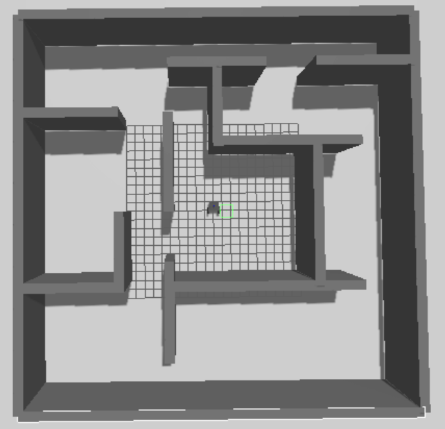
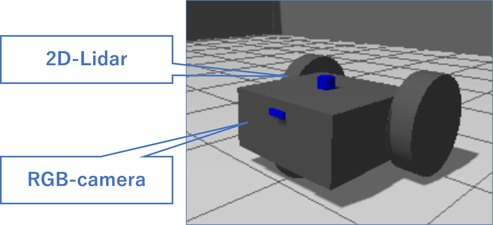

# simple_world4ignition_gazebo

## World 

    

## Robot

## Requirement
ubuntu22.04

ROS2 Humble

Ignition Gazebo 6.16.0

## Operating environment
wsl2 in Windows11

## Sensor type installed on the robot
2D-Lidar

Imu

Wheel Odometry

RGB-camera

## Usage

### Install 
`git clone https://github.com/hirotakasaito/simple_world4ignition_gazebo.git`

### Operate the robot from the keyboard
`ros2 run teleop_twist_keyboard teleop_twist_keyboard`

### All launch
`ros2 launch ./all_launch.py`

